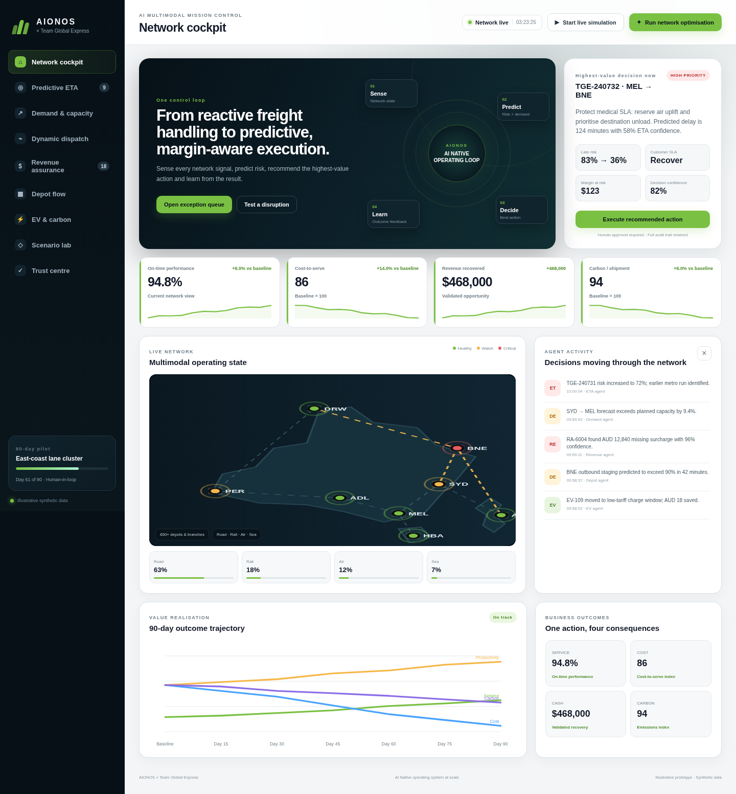

# AIONOS × Team Global Express — Multimodal Mission Control

A static, JSON-backed supply-chain optimisation demo designed for GitHub Pages. It turns the transformation concepts from the AIONOS × TGE deck into an interactive application.



## What the demo includes

- Executive network cockpit with live KPIs and animated network state
- Predictive ETA and exception-control workbench
- Demand forecasting and capacity recommendations
- Dynamic dispatch optimisation with before/after results
- Shipment-level revenue assurance
- Depot flow optimisation
- EV route-fit, charging and carbon optimisation
- Scenario lab for peak demand, rail disruption, severe weather and depot congestion
- Human-in-the-loop action history and model guardrails
- All demo data stored in `/data/*.json`

## Deploy with GitHub Pages

1. Create a new GitHub repository.
2. Upload all files and folders from this ZIP to the repository root.
3. Open **Settings → Pages**.
4. Under **Build and deployment**, choose **Deploy from a branch**.
5. Select the `main` branch and `/ (root)`, then save.

The site is fully static and requires no backend or build step.

## Run locally

Because browsers block JSON fetches when opening `index.html` directly, serve the folder over HTTP:

```bash
npm run dev
```

Then open the URL shown by `serve`.

Alternative:

```bash
python -m http.server 8080
```

Open `http://localhost:8080`.

## Data

All data is synthetic and illustrative. Edit the JSON files in `/data` to change lanes, shipments, depots, routes, leakage cases, EVs, scenarios or the activity feed.

## Main controls

- **Run network optimisation** calculates a coordinated improvement across ETA, dispatch, depot, cost, carbon and revenue KPIs.
- **Start live simulation** creates continuous network events and KPI movement.
- Page-level action buttons apply recommended interventions and show immediate before/after impact.
- **Scenario Lab** applies a disruption, then runs AIONOS response actions to recover the network.

## License

Demo source is provided for presentation and prototype use.
